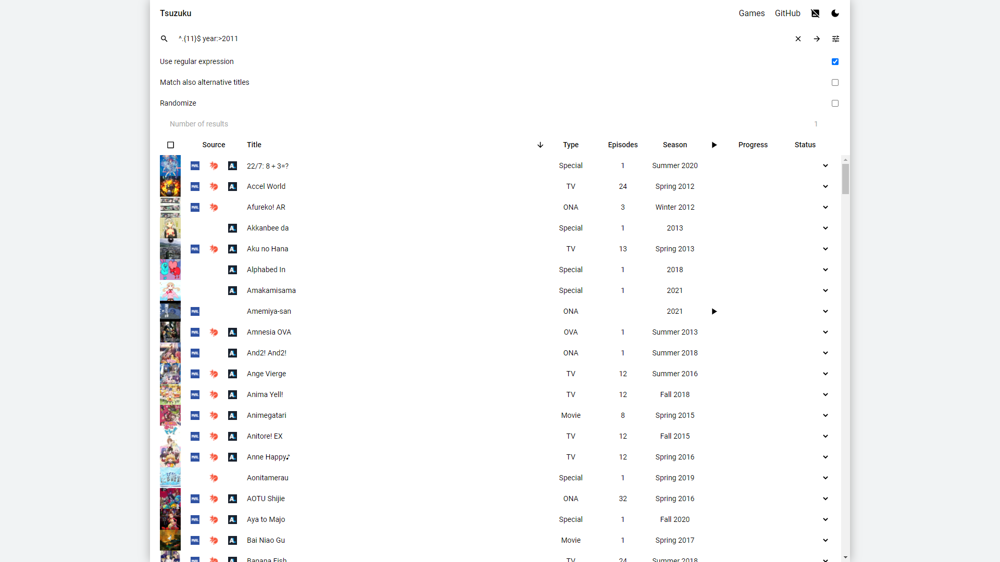

# Tsuzuku
__Tsuzuku__ is an IndexedDB-based anime tracker that uses the [anime-offline-database](https://github.com/manami-project/anime-offline-database) as its metadata provider.

## Usage
1. Download ZIP
1. Extract
1. Open `index.html`[[1]](#1)
1. Search titles __or__ import your [MyAnimeList](https://myanimelist.net/panel.php?go=export) or [Kitsu](https://kitsu.io/settings/exports) XML[[2]](#2)

<a id="1">[1]</a> Tested in the latest stable build of [Chromium](https://chromium.woolyss.com) and [Firefox](https://www.mozilla.org/en-US/firefox/new/)
 
<a id="2">[2]</a> Will __only__ import `<series_animedb_id>`, `<series_title>`, `<series_type>`, `<series_episodes>`, `<my_watched_episodes>`, and `<my_status>`

## Dependencies
* anime-offline-database
* [Color Thief](https://github.com/lokesh/color-thief)
* [jQuery](https://github.com/jquery/jquery)[[3]](#3)

<a id="3">[3]</a> Will be removed
